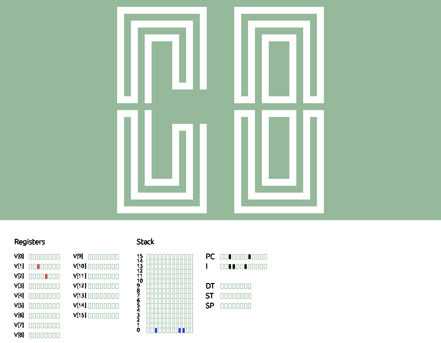

# Chip255


Chip255 is CHIP-8 interpreter/emulator written in the Processing programming language. This interpreter features a debug overlay to view the current state of the machine. This includes registers, the stack, and other variables such as the program counter and timers. For more information on CHIP-8, here's the [Wikipedia link](https://en.wikipedia.org/wiki/CHIP-8)

The CHIP-8 uses a hexidecimal keypad for input. Chip255 maps each key like so:
```
1 2 3 C  ->  1 2 3 4
4 5 6 D  ->  q w e r
7 8 9 E  ->  a s d f
A 0 B F  ->  z x c v
```

## Contributing
This project is no longer actively maintained (it wasn't in the first place). However if you see any improvements that can be done, feel free to contribute any way you see fit.

## Example images:


